## Gene Expression Anti-profiles 

 

Motivated by observations that gene expression hyper-variability is enriched in specific regions of epigenetic alteration in colon cancer...

## Gene Expression Anti-profiles 

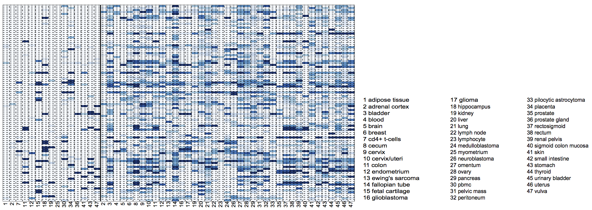

...and that _consistent hypervariability_ across tumor types is enriched in genes involved in tissue specificity

## Gene Expression Anti-profiles 

_anti-profile score_: measures sample-specific deviation from normal expression in consistently hyper-variable genes

## Gene Expression Anti-profiles 

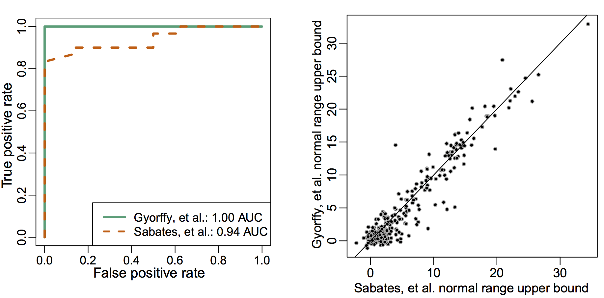

Good cross-experiment properties  
Stability in _normal_ expression across experiments

## Gene Expression Anti-profiles

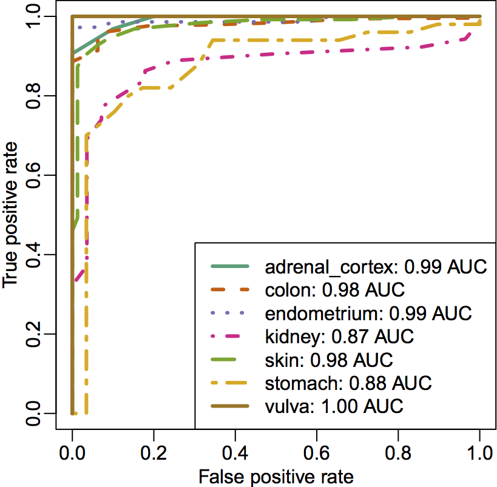

Prediction in leave-one-tissue out experiment  

## Gene Expression Anti-profiles 

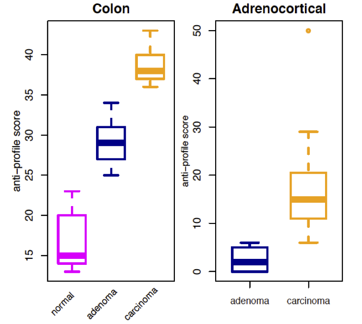

Anti-profile score distinguishes between stages in tumor progression

## Gene Expression Anti-profiles 

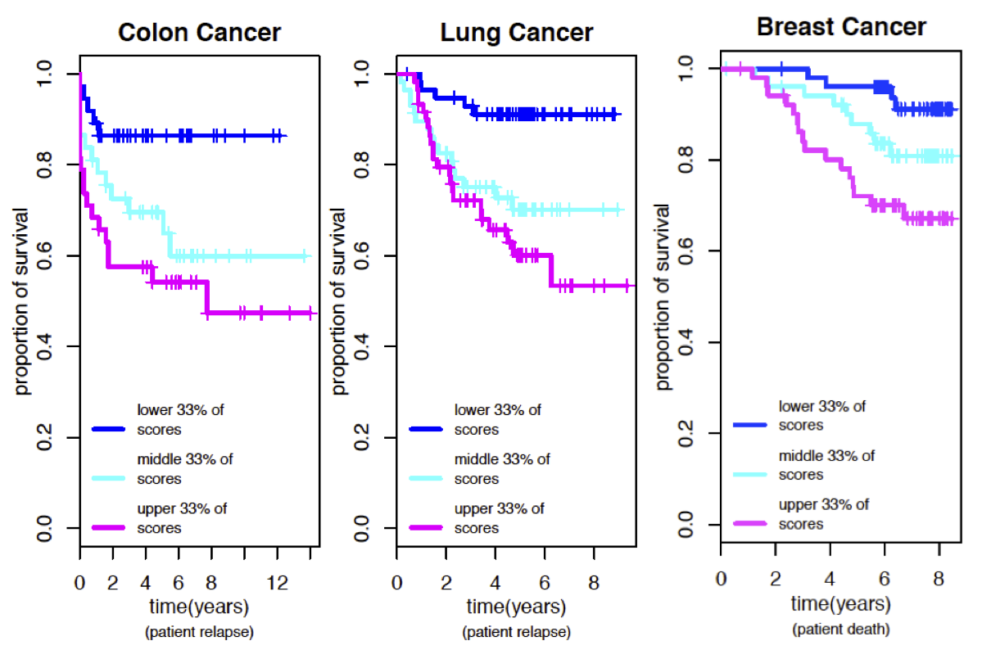

Stratification based on anti-profile score

## Gene Expression Anti-profiles { .hcb_image }

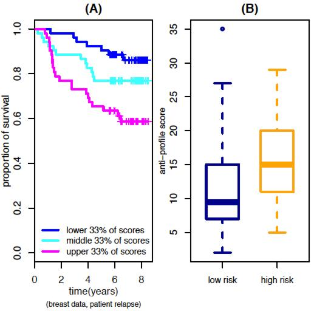

Stratification of breast samples based on anti-profile score

## Summary

>- Simple counting scheme produces robust stable and accurate (anti)-profiles  
>- Nice prediction properties _across experiments_ and _across tissue types_  
>- Captures increasing hyper-variability associated with progression and prognosis

---

# Stability Analysis via Large-Margin Function Approximation

# Stability Analysis via Support Vector Machines

## One-class Support Vector Machines 

Support Vector Machines for Anomaly Detection: determine if observations belong to a given group or are _anomalies_.

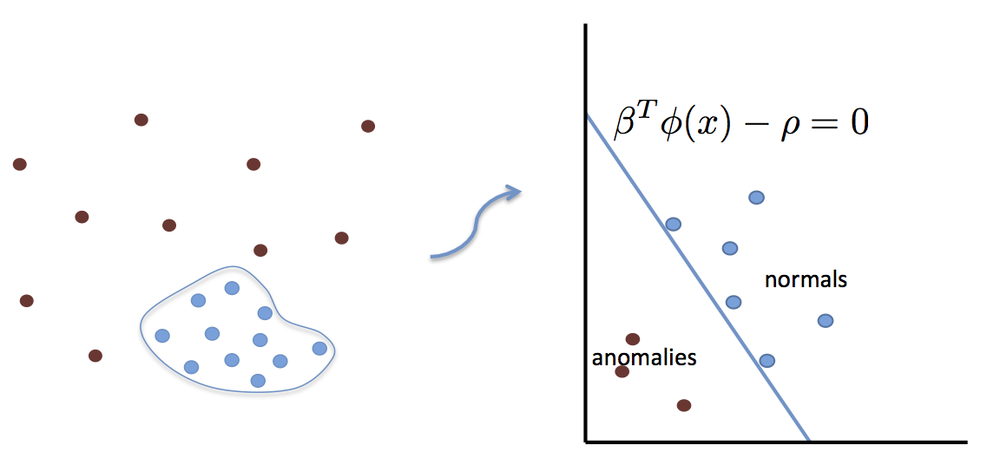

## Anomaly Classification

>- Distinguish observations from two _anomalous_ groups (e.g., adenoma vs. tumor)

>- How can we incorporate the fact that we are classifying anomalies?

>- Why (and when) is it worth doing that?

## Anomaly Support Vector Machine 

Learning functions in space spanned by (representers) of normal samples

$$
f(x) = \sum_i c_i k(x, z_i) + d
$$

where $z_i$ are _normal_ observations.

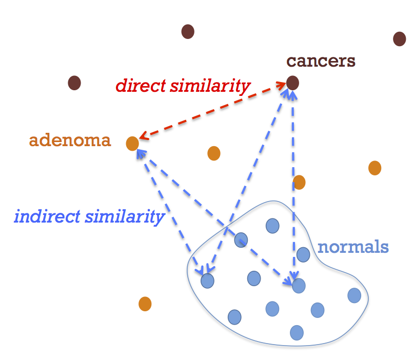

## Anomaly Support Vector Machine 

Estimated as solution to optimization problem (like regular SVM) by solving

$$
\min_{c,d} \sum_j (1-y_jf_j)_+ + c'\tilde{K}c
$$

with $f_j = \sum_i c_i k(x_j,z_i) + d$, and  
$\tilde{K}=K_s K_n^{-1} K_s$

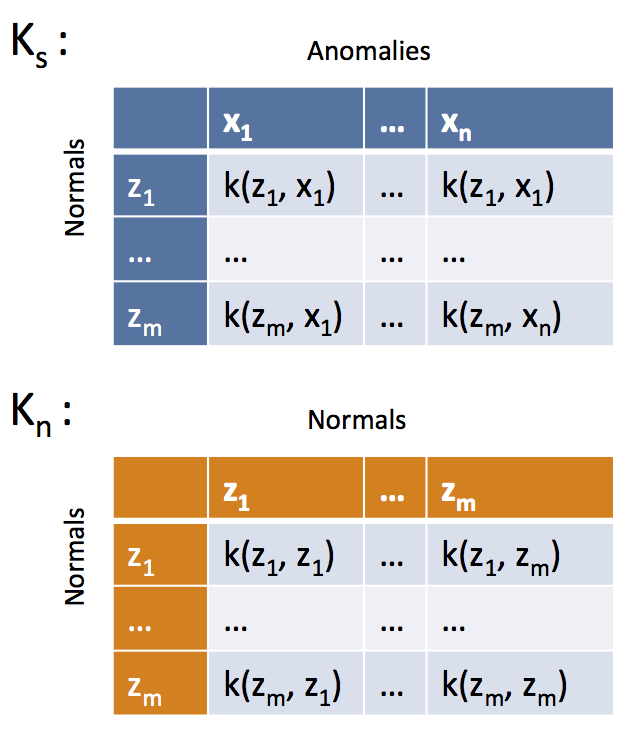

## Anomaly Support Vector Machine

>- Based on leave-one-out error bounds (via stability arguments)
>- $K \succeq \tilde{K}$, implies LOO error bound of Anomaly SVM is lower than LOO error bound of standard pairwise between anomalies SVM
>- Proof uses arguments based on the SVM path algorithm, and required conditions

## Stability and accuracy of Anomaly SVM 

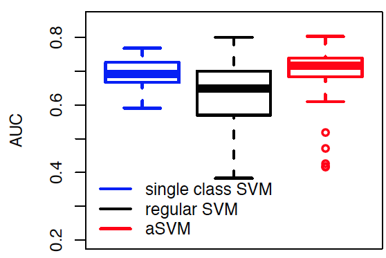

Prediction of high vs. low relapse risk in lung cancer 

## Stability and accuracy of Anomaly SVM 

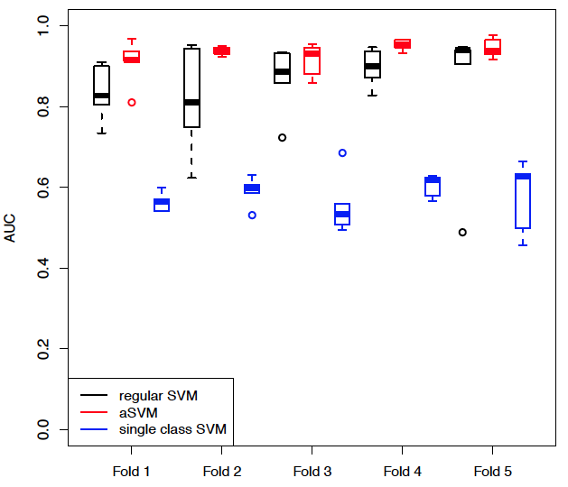

Prediction of _suspect_ vs. _pathological_ fetal CTG data (*not genomics*)

## Summary

>- Profiles learned based on hyper-variability show consistent behavior across tissues and across experiments in tumor prognosis and progression

>- We can extend the general anti-profile idea to a function approximation setting

>- Use sensitivity-based cross-validation error bounds to characterize the effect of incorporating normal observations when classifying between anomalies

>- Indirect _similarity_ through normal samples improves stability while improving prediction performance

---

###Acknowledgements
**Wikum Dinalankara**: (formerly) Ph.D. student @ U. Maryland (now postdoc @ Johns Hopkins)  
**Nick Thieme**: Ph.D. student @ U. Maryland  

###References
Corrada Bravo, et al. (2012) _BMC Bioinformatics_.  
Dinlanakara et al. (2015) _Cancer Informatics_.  
Dinalankara et al. _In preparation_  

###Contact
[http://hcbravo.org](http://hcbravo.org)  
[\@hcorrada](https://twitter.com/hcorrada)    

