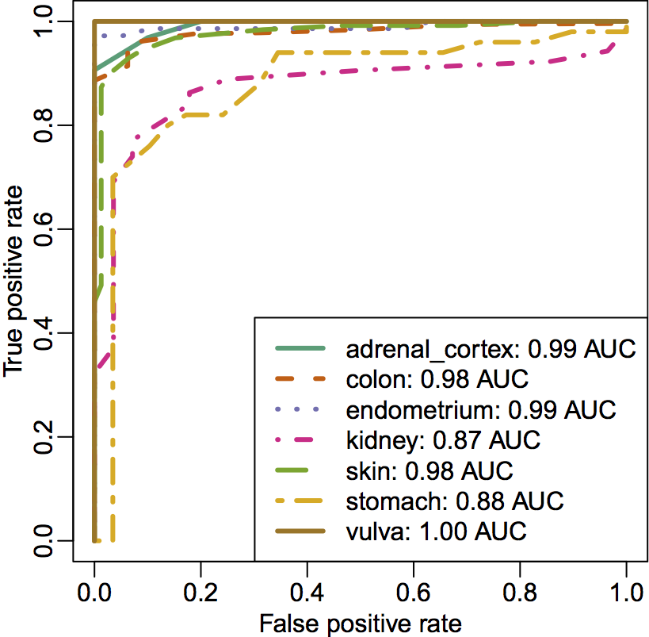
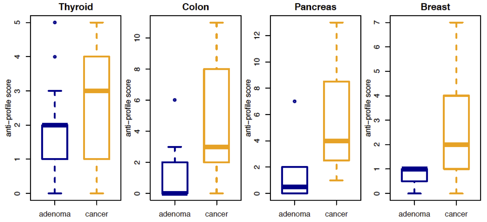

## Gene expression anti-profiles

- molecular methods for cancer detection, prognosis and treatment matching will be the basis of individualized medicine
- gene expression profile methods have been subject of study for decades
- very few proposed predictors are translated to the clinic
- by far, the biggest culprit is irreproducibility of results in preliminary studies

---

_anti-profile score_: measures sample-specific deviation from normal expression in consistently hyper-variable genes

<footer class="source">BMC Bioinformatics, 2013</footer>

---

- **Feature selection**: top 100 genes with greatest **hyper-variable** expression in tumor:

$$
\log_2 \frac{\text{std. dev}_{\text{cancer}}}{\text{std. dev}_{\text{normal}}}
$$

- **Range of normal expression**: 

$$
\mathrm{med} \, \text{normal expression}_g \pm 5 \times \mathrm{mad} \, \text{normal expression}_g
$$

- **anti-profile score**: number of genes in sample where expression is outside normal range

---

Good cross-experiment properties  
Stability in _normal_ expression across experiments

<footer class="source">BMC Bioinformatics, 2013</footer>

---

Prediction in leave-one-tissue out experiment  

<footer class="source">BMC Bioinformatics, 2013</footer>

---

Anti-profile score distinguishes between stages in tumor progression

<footer class="source">Cancer Informatics, 2015</footer>

---

DNA methylation anti-profiles score distinguishes between stages in tumor progression

<footer class="source">Cancer Informatics, 2015</footer>

---

Stratification based on anti-profile score

<footer class="source">Cancer Informatics, 2015</footer>

---

Stratification of breast samples based on anti-profile score

<footer class="source">Cancer Informatics, 2015</footer>

## Summary

>- Simple counting scheme produces robust stable and accurate (anti)-profiles  
>- Nice prediction properties _across experiments_ and _across tissue types_  
>- Captures increasing hyper-variability associated with progression and prognosis

## Stability Analysis via Support Vector Machines

**One-class Support Vector Machines**

Support Vector Machines for Anomaly Detection: determine if observations belong to a given group or are _anomalies_.

## Anomaly Classification

- Distinguish observations from two _anomalous_ groups (e.g., adenoma vs. tumor)

- How can we incorporate the fact that we are classifying anomalies?

- Why (and when) is it worth doing that?

## Anomaly Support Vector Machine 

Learning functions in space spanned by (representers) of normal samples

$$
f(x) = \sum_i c_i k(x, z_i) + d
$$

where $z_i$ are _normal_ observations.

## Anomaly Support Vector Machine 

Estimated as solution to optimization problem (like regular SVM) by solving

$$
\min_{c,d} \sum_j (1-y_jf_j)_+ + c'\tilde{K}c
$$

with $f_j = \sum_i c_i k(x_j,z_i) + d$   

and $\tilde{K}=K_s K_n^{-1} K_s$

## Anomaly Support Vector Machine

>- Using leave-one-out error bounds (via stability arguments)  
>- $K \succeq \tilde{K}$, implies LOO error bound of Anomaly SVM is lower than LOO error bound of standard pairwise between anomalies SVM
>- Proof uses arguments based on the SVM path algorithm, and mild conditions

## Stability and accuracy of Anomaly SVM 

Prediction of high vs. low relapse risk in lung cancer 

---

Prediction of _suspect_ vs. _pathological_ fetal CTG data (*not genomics*)

## Summary

>- Profiles learned based on hyper-variability show consistent behavior across tissues and across experiments in tumor prognosis and progression

>- We can extend the general anti-profile idea to a function approximation setting

>- Use sensitivity-based cross-validation error bounds to characterize the effect of incorporating normal observations when classifying between anomalies

>- Indirect _similarity_ through normal samples improves stability while improving prediction performance

