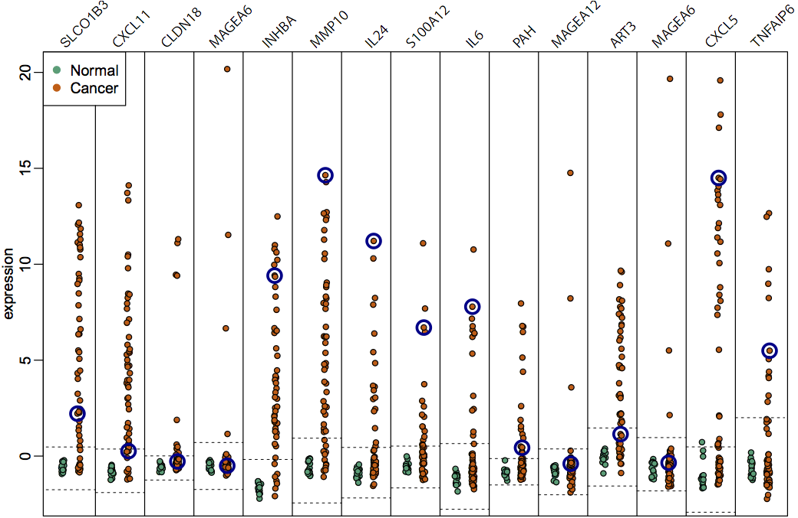

## What is Epigenomics? 

### What makes them different?

Much human variation is due to difference in ~6 million DNA base pairs (0.1% of genome) 

- Phenotype, including disease susceptibility
- One led a fairly strict diet and regimen, had pancreatic cancer, the other did not
- While that gives a lot of information about the molecular basis of certain processes,
it is not the full story. 

---

### What makes them different?

Genes are **expressed** differently during different **stages** and in different **tissues**.

- Something that we want to understand is how that genetic variation leads to phenotypic variation.
- A major part of understanding that, comes from understanding how regulation works.

---

DNA is packed, making certain parts inaccessible, and this packing is **dynamic**.

- DNA structure plays a major role

## What is Epigenomics?

DNA methylation is a chemical modification of DNA, regulates *gene expression*.

<footer class="source">[Robertson and Wolffe, Nat Rev Genet, 2000]</footer>

- DNA methylation plays a major role in this regulation process
- Plus, we know how it is inherited from cell to cell, cell-fate
- invovled in differentiation
- can give us an important idea of this process in development and disease
- plasticity

---

## Probing DNA Methylation

## Probing DNA Methylation

## Probing DNA Methylation

---

---

## Probing DNA Methylation

- Local-likelihood smoothing method
- high-frequency smoothing reveals local methylation structure (small domains)
- low-frequency smoothing reveals long-range methylation structure (large domains)

<footer class="source">
  Nature Genetics, 2011\br
  Bioinformatics, 2013
</footer>

## DNA Methylation in cancer

Large blocks of *hypo-methylation in colon cancer

<footer class="source">Nat. Genetics, 2011</footer>

- long, 
- consistent but partially methylated in normal tissues
- while methylation levels are inconsistent in cancer, boundaries of these domains are conserved across tissues

- overlaps with other important genomic domains
- genes within these blocks are **tissue-specific**

---

Genes with *hyper-variable* expression in colon cancer are enriched within these blocks.

<footer class="source">Nat. Genetics, 2011</footer>

---

Hypo-methylation blocks observed in other cancer types.

<footer class="source">Genome Medicine, 2014</footer>

---

Gene expression hyper-variability enriched in hypo-methylation blocks in other cancer types.

<footer class="source">Genome Medicine, 2014</footer>

---

<footer class="source">BMC Bioinformatics, 2013</footer>

Genes with *consistent hyper-variable expression* across tumors are tissue-specific.

## Summary

- Large domains of methylation loss is a stable mark across different cancer types
- Gene expression hyper-variability is enriched within these domains
- Genes within these regions are tissue-specific and involved in cellular fate

---

Genes are **expressed** differently during different **stages** and in different **tissues**.
