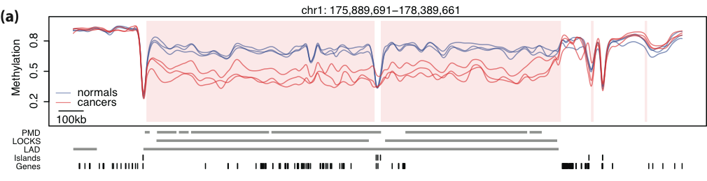

---

## What is epigenomics?

.center[.large[What makes them different?]]

.center[.image-60[]]

Genes are **expressed** differently during different **stages** and in different **tissues**.

???

- Something that we want to understand is how that genetic variation leads to phenotypic variation.
- A major part of understanding that, comes from understanding how regulation works.

---
class: split-50, middle

## What is epigenomics?

.column[
DNA methylation is a chemical modification of DNA, involved in *gene expression* regulation.
]

.column[
.center[.image-30[]]
]

.source[[Robertson and Wolffe, Nat Rev Genet, 2000]]

???

- DNA methylation plays a major role in this regulation process
- Plus, we know how it is inherited from cell to cell, cell-fate
- invovled in differentiation
- can give us an important idea of this process in development and disease
- plasticity

---

## Probing DNA methylation

.center[
.image-100[]
]

---
class: split-50, middle

## Probing DNA methylation

.column[
.image-90[]
]

.column[
- local-likelihood smoothing method
- **high-frequency smoothing** estimates local methylation structure (small domains)
- **low-frequency smoothing** estimates long-range methylation structure (large domains)
]

.source[[Nature Genetics, 2011]\br
[Bioinformatics, 2013]
]

---

## DNA methylation in cancer

.center[.image-100[]]

Large blocks of **hypo-methylation** in colon cancer

- consistent partially methylated in normal tissues
- cancer levels are inconsistent, boundaries conserved across samples
- overlaps with other important genomic domains
- genes within these blocks are **tissue-specific**

.source[[Nat. Genetics, 2011]]

---
class: middle
exclude: true

.center[.image-100[]]

**Hypo-methylation** blocks observed across five solid tumor types.

.source[[Genome Medicine, 2014]]

---
class: middle

.center[.image-80[]]

Genes with **hyper-variable** expression in colon cancer are enriched within these blocks.

.source[[Nat. Genetics, 2011]]

---
class: middle
exclude: true

.center[.image-100[]]

Gene expression **hyper-variability** enriched in hypo-methylation blocks in other cancer types.

.source[[Genome Medicine, 2014]]

---
class: middle
exclude: true

Genes with **consistent hyper-variable expression** across tumors are _tissue-specific_.

.source[[BMC Bioinformatics, 2013]]

---

## Summary

- large domains of methylation loss are a stable mark across cancer types
- gene expression hyper-variability is enriched within these domains
- hyper-variable genes within these regions are tissue-specific and involved in cellular fate

