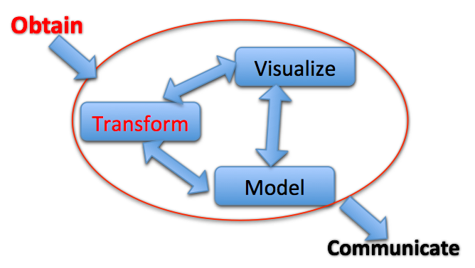
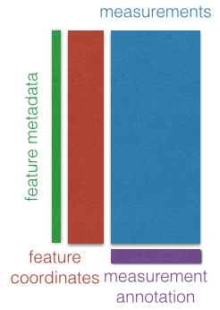

---
class: split-50

## Software

.column[
.image-50[]
- State-of-the-art computational and statistical analysis
platform
- We develop and apply methods for these analyses in this platform
- Our collaborators do analysis in this platform with us
]
.column[
- `metagenomeSeq`
- `metagenomeFeatures`
- `antiProfiles`
- `minfi`
- `bumphunter`
- `HTShape`
- `qsmooth`
- `Rcplex`
- `Rcsdp`
]

---

### Collaborative and exploratory analysis

- *Data transformation and modeling*: data smoothing, region finding
(R/Bioconductor: `Bsmooth`, `minfi`)

--

- *Exploration*: search by gene, search by overlap

--

- *Contextual analysis*: overlap with other data (our own, other labs, UCSC, ensembl)

---

## Genomic Data Science  

- We have unprecedented ability to measure
- and lots of publicly available data to contextualize it

<div class="centered">


<footer class="source">[H. Wickham]</footer>
</div>

---

.center[.image-40[]]


### Integrative, visual and computational exploratory analysis of genomic data

- Browser-based
- Interactive
- Integration of data
- Reproducible dissemination
- Communication with R/Bioconductor: `epivizr` package

e.g.: http://epiviz.cbcb.umd.edu/?ws=YOsu0RmUc9l

<!--
<footer class="source">[Nat. Methods, 2014]</footer>
-->

---
exclude: true

<iframe src="http://epiviz.cbcb.umd.edu/?ws=clHVLu0BQti" height="800"></iframe>

---
class: middle

## Creativity in exploration

We are building software applications to support creative exploratory analysis of large genome-wide datasets...

.center[.image-60[]]

<!--
<footer class="source">[T. Speed]</footer>
-->

---
class: middle

### Summarization

Summarize integrated measurements (computed on data subsets)

.center[
<video height="500" controls>
  <source src="movies/transform_aggregate.mp4" type="video/mp4">
</video>
]


---
class: middle

### Statistically-guided exploration

Calculate a statistic of interest

```r
# Get tumor methylation base-pair data
m <- assay(se)[,"tumor"]

# Compute regions with highest variability across cpgs
region_stat <- calcWindowStat(m, step=25, window=80, stat=rowSds)
s <- region_stat[,"stat"]
```

Explore data based on statistic

_What's around the regions with highest across CpG variability?_

```r
# get locations in decreasing order
o <- order(s, decreasing=TRUE)
indices <- region_stat[o, "indices"]
slideShowRegions <- rowRanges(se)[indices] + 1250000L
mgr$slideshow(slideShowRegions)
```

---
class: center, middle

<video height="550" controls>
  <source src="movies/guided_exploration_v2.mp4" type="video/mp4">
</video>

---
class: middle

### Dynamically extensible

Easily integrate new data types and add new visualizations.

<div class="centered">

</div>

- Based on classic "three-table" design in genomic data analysis
- **Data providers define coordinate space**

---

<div class="centered">
<video height="550" controls>
  <source src="movies/finance.mp4" type="video/mp4">
</video>
</div>

---
class: middle

### Visualization design goals

- Context 
  - Integrate and align multiple data sources; navigate; search
  - *Connect*: brushing
  - *Encode*: map visualization properties to data on the fly
  - *Reconfigure*: multiple views of the same data

<!--
<footer class="source">[Perer & Shneiderman]</footer>
-->

---
class: middle

### Visualization design goals

- Data
  - *Select and filter*: tight-knit integration with R/Bioconductor; 
  - (current work) filters on visualization propagate to data environment
- Model
  - New 'measurements' the result of modeling; perhaps suggested by data context

<!--
<footer class="source">[Perer & Shneiderman]</footer>
-->

---
class: middle

.center[


]

<!--
<footer class="source">[H. Wickham]</footer>
-->

Specific challenge for epigenomic data analysis is how to integrate  *many relevant sources of contextual data*

- Easily access/integrate *contextual* data
- Driven by exploratory analysis of *immediate* data
- Iterative process
- Visual and computational exploration go hand in hand

