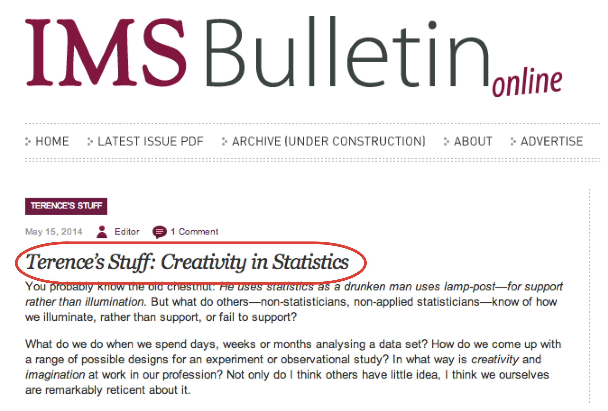

## Tools

<div class="columns-2">

<div>
<div class="centered">

</div>

- State-of-the-art computational and statistical analysis
platform
- We develop and apply methods for these analyses in this platform
- Our collaborators do analysis in this platform with us
</div>

<div>
- `antiProfiles`
- `minfi`
- `bumphunter`
- `Rcplex`
- `Rcsdp`
- `HTShape`
- `qsmooth`
</div>

</div>

---

**Collaborative and exploratory analysis**

> - Data transformation and modeling: data smoothing, region finding (R/Bioconductor: `Bsmooth`, `minfi`)
> - Genome browsing: search by gene, search by overlap
> - Region analysis: overlap with other data (our own, other labs, UCSC, ensembl)
> - Regulation: expression data (Gene Expression Barcode)

## Genomic Data Science! 

- We have unprecedented ability to measure
- and lots of publicly available data to contextualize it

<div class="centered">


<footer class="source">[H. Wickham]</footer>
</div>

---

<div class="centered">

</div>


### Integrative, visual and computational exploratory analysis of genomic data

- Browser-based
- Interactive
- Integration of data
- Reproducible dissemination
- Communication with R/Bioconductor: `epivizr` package

e.g.: http://epiviz.cbcb.umd.edu/ws=45KBV4C7z3u
<footer class="source">[Nat. Methods, 2014]</footer>

---

<iframe data-src="http://epiviz.cbcb.umd.edu/?ws=W3ieGz19icm" width="99%"></iframe>

---

---

### Creativity in exploration

We are building software systems to support creative exploratory analysis of large genome-wide datasets...

<div class="centered">

</div>
<footer class="source">[T. Speed]</footer>

---

**Computed Measurements**: create new measurements from integrated measurements and visualize

<div class="centered">
<video width="75%" height="75%" autoplay>
  <source src="movies/transform_customize_v2.mp4" type="video/mp4">
</video>
</div>

---

**Summarization on the fly**: create new measurements from integrated measurements and visualize

<div class="centered">
<video width="75%" height="75%" autoplay>
  <source src="movies/transform_aggregate.mp4" type="video/mp4">
</video>
</div>


---

**Statistically-guided exploration**: 
Calculate a statistic of interest

```r
# Get tumor methylation base-pair data
m <- assay(se)[,"tumor"]

# Compute regions with highest variability across cpgs
region_stat <- calcWindowStat(m, step=25, window=80, stat=rowSds)
s <- region_stat[,"stat"]
```

--- 

**Statistically-guided exploration**:
Explore data based on statistic

_What's around the regions with highest across CpG variability?_

```r
# get locations in decreasing order
o <- order(s, decreasing=TRUE)
indices <- region_stat[o, "indices"]
slideShowRegions <- rowRanges(se)[indices] + 1250000L
mgr$slideshow(slideShowRegions)
```

---

<div class="centered">
<video width="75%" height="75%" autoplay>
  <source src="movies/guided_exploration_v2.mp4" type="video/mp4">
</video>
</div>

---

**dynamically extensible**: 
Easily integrate new data types and add new visualizations.

http://epiviz.cbcb.umd.edu/?gist[]=11017650&ws=Y8kWxCO2Ajn
<iframe data-src="http://epiviz.cbcb.umd.edu/?gist[]=11017650&ws=Y8kWxCO2Ajn"></iframe>

---

<div class="centered">

</div>

- Based on classic "three-table" design in genomic data analysis
- **Data providers define coordinate space**

---

http://epiviz.cbcb.umd.edu/?ws=SRHZlWRRAPd&gist[]=a82a998817564ce3fe48&settings=default&
<iframe data-src="http://epiviz.cbcb.umd.edu/?ws=SRHZlWRRAPd&gist[]=a82a998817564ce3fe48&settings=default&"></iframe>

---

<div class="centered">


<footer class="source">[H. Wickham]</footer>
</div>

One interpretation of *Big Data* is *Many relevant sources of contextual data*

- Easily access/integrate *contextual* data
- Driven by exploratory analysis of *immediate* data
- Iterative process
- Visual and computational exploration go hand in hand

---

### Visualization goals

- Context 
  - Integrate and align multiple data sources; navigate; search
  - *Connect*: brushing
  - *Encode*: map visualization properties to data on the fly
  - *Reconfigure*: multiple views of the same data

<footer class="source">[Perer & Shneiderman]</footer>

---

- Data
  - *Select and filter*: tight-knit integration with R/Bioconductor; 
  - (current work) filters on visualization propagate to data environment
- Model
  - New 'measurements' the result of modeling; perhaps suggested by data context

<footer class="source">[Perer & Shneiderman]</footer>

