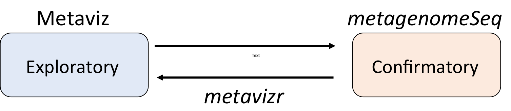

---
layout: false
class: inverse, center, middle

# Interactive Data Analysis

---
layout: true

## Statistically guided visualization

---
class: split-50

.column[
How can we make the connection between two modes of 
analysis tighter?
]

.column[
.center.image-50[]
]

---
class: split-50

.column[
Computational steering of visual exploration via _proactive computation_
]

.column[
.center.image-50[]
]

---
layout: true

## Statistically guided visualization

---
exclude: true
class: split-50

.column[
Let's revisit the Data Analysis modes

How can we make the connection between two modes of 
analysis tighter?
]

.column[
.center.image-50[]
]

---
exclude: true
class: split-50

.column[
One idea: statistically guided visual exploration via _proactive computation_

Back to Epiviz: epigenetic regulation of gene expression across multiple tumor types (Timp et al. 2016)
]

.column[
.center.image-50[]
]

---
class: split-50

.column[
Computational steering of visual exploration via _proactive computation_

Analysis runs in background (proactive computation)

"Interesting results" presented to user, steers exploration of data underlying result.

.source[https://github.com/epiviz/epiviz_feed_polymer]
]

.column[
.center.image-50[]
]

---

.center[
<video height="450px" controls>
  <source src="movies/epiviz-feed.mp4" type="video/mp4">
</video>
]

