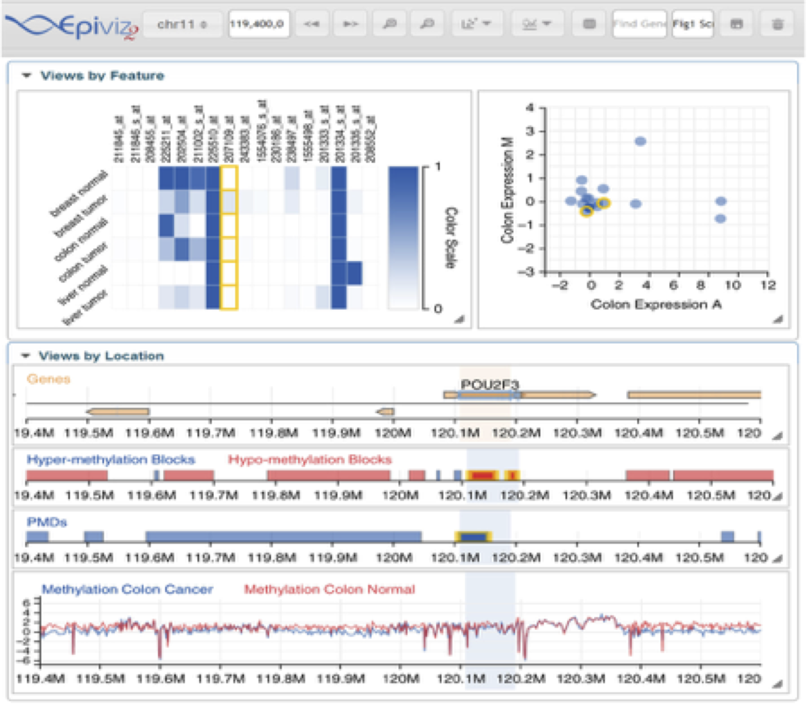

class: title-slide, center, middle
count: false

.banner[]

.title[Interactive, visual and statistical exploratory analysis of epigenomic data]

.author[Héctor Corrada Bravo]

.other-info[
Center for Bioinformatics and Computational Biology  
University of Maryland, College Park, USA  
VIZBI '17: June 14, 2017
]

.logo[]

---
class: split-50

## What does my group do?

.column[
Study the **molecular** basis of *variation* in development and disease


Using **high-throughput** experimental methods  
]

.column[.image-80[]]

```{r child='epigenomics.Rmd'}
```

```{r child='epiviz.Rmd', eval=FALSE}
```

```{r child='reflection.Rmd', eval=FALSE}
```

---

**Acknowledgements**  

Justin Wagner, Jayaram Kancherla (CBCB)    
Florin Chelaru (now at Google), Joseph Paulson (now at Genentech)  
Feinberg Lab & K. Hansen (JHU), R. Irizarry (Harvard)

Funding: NIH, Genentech, Gates Foundation  

**More information**

[http://hcbravo.org](http://hcbravo.org)  
[\@hcorrada](https://twitter.com/hcorrada)    


