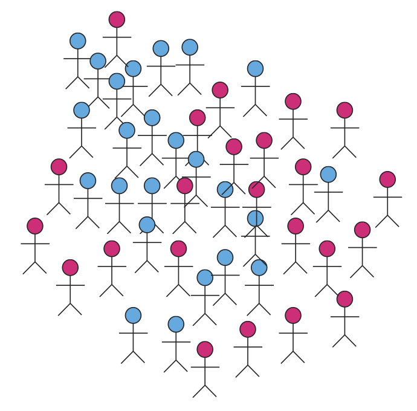

---

**What does my group do?**

<div class="columns-2">

<div style="padding-bottom: 400px;">
- Study the **molecular** basis of *variation* in development and disease
- Using **high-throughput** experimental methods
</div>

<div class="centered">

</div>

</div>

```{r child='epigenomics.Rmd'}
```

```{r child='epiviz.Rmd' }
```

---

**Acknowledgements**  

Justin Wagner, Jayaram Kancherla (CBCB)    
Florin Chelaru (now at Google), Joseph Paulson (now at Genentech)  
Feinberg Lab & K. Hansen (JHU), R. Irizarry (Harvard)

Funding: NIH, Genentech, Gates Foundation  

**More information**

[http://hcbravo.org](http://hcbravo.org)  
[\@hcorrada](https://twitter.com/hcorrada)    


