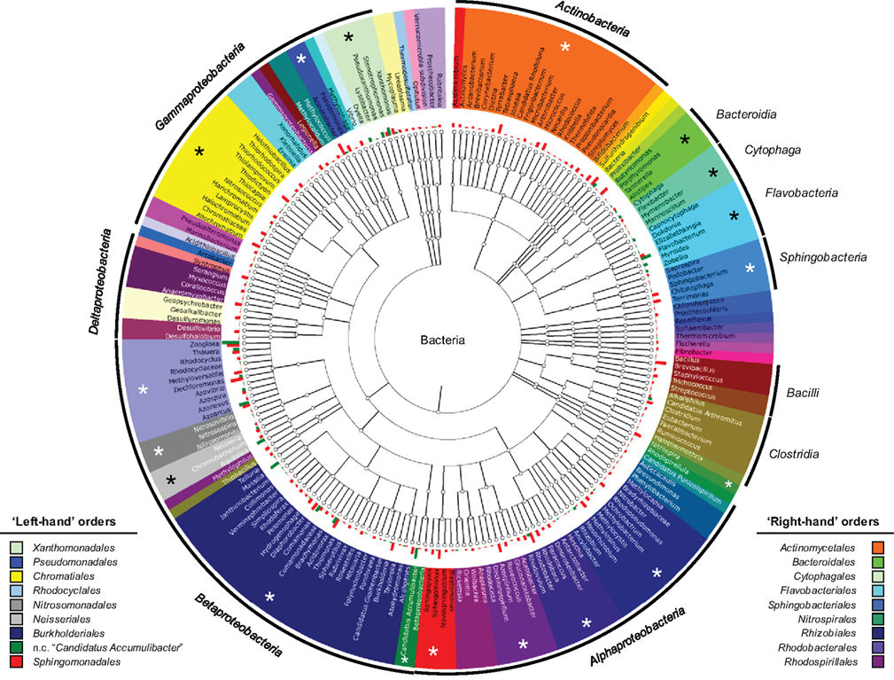
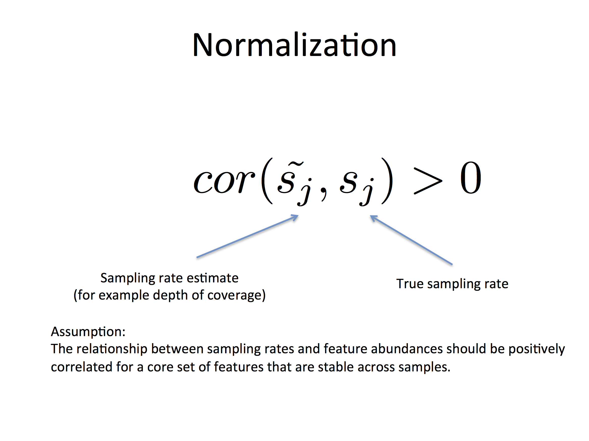
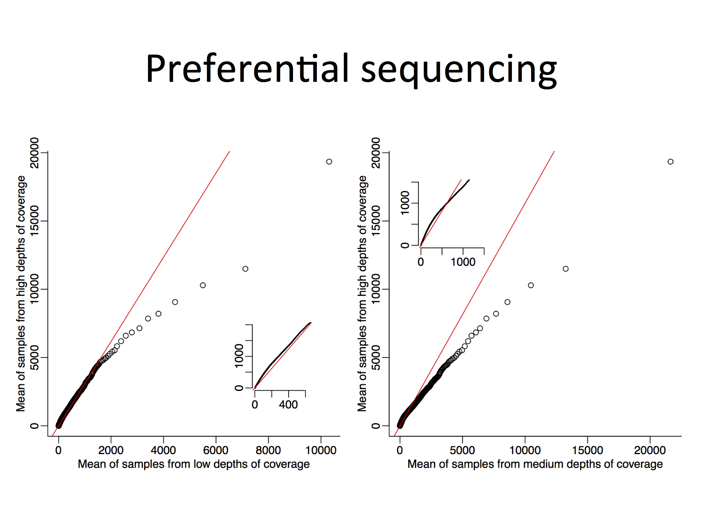

## Metagenomics (mixed genomes)

- Discoveries: pathogenic associations for childhood diarrhea in developing world. (Genome Biology, 2014)
- Methods: association discovery for metagenomic communities. (Nature Methods, 2013)
- Tools: `metagenomeSeq`, `metagenomicFeatures`, `metaviz`

<footer class="source">[Human Microbiome Project]</footer>

## Metagenomics (mixed genomes)

What is the measurement?

## Metagenomics (mixed genomes)

What is the measurement?

---

**Samples**:

---

**Features**:

## Challenges for epidemiological metagenomic studies

- Analysis units (features) unknown a priori
- High levels of sparsity
- Standard normalization methods don't work well
- Confounders, i.e. study site, countries, etc.
- Large number of features (Type 1 error control)

## Normalization

---

## Normalization

## Normalization

## Normalization

## Zero-inflation

## Zero-inflation

## Zero-inflation

## Zero-inflation

## Zero-inflation

## Zero-inflation

## Zero-inflation

## `MetagenomeSeq`

## `MetagenomeSeq`

## `MetagenomeSeq`

## `MetagenomeSeq`

## `MetagenomeSeq`

## `MetagenomeSeq`

## `MetagenomeSeq`

## `MetagenomeSeq`

## `MetagenomeSeq`

## Summary

- Diarrheal study consisting ~1000 samples (now ~3000). 
- Interesting microbiome for four countries / through ages
- Novel normalization and differential abundance testing framework for marker-gene surveys

---

Hierachically organized features

---

Hierarchically organized features

<video height="500" controls>
<source src="movies/metavizr1.mp4" type="video/mp4">
</video>

---

Defining the measurement unit of analysis

<video width="75%" height="75%" controls>
  <source src="movies/metavizr2.mp4" type="video/mp4">
Your browser does not support the video tag.
</video>

---

Not just features, but samples may be hierarchically organized

## Challenges

- Underlying idea: _cut_ in the tree defines unit of analysis

> - Visual design challenges: how to support _effective_ exploration of cuts (persistence, consistency, density)

> - Data challenges: how to support _efficient_ exploration of cuts (graph database backend for _contextual_ data)

> - Engineering challenges: when do analysis patterns become interaction modes

## Summary

> - Systems for interactive (and creative) data exploration and analysis of epigenomic and metagenomic data
> - Design exploration of hierarchical domains with statistical analysis as the ultimate goal
> - Collaborative, reproducible, with close connection with R/Bioconductor (`metagenomeSeq`, `metagenomeFeatures`, `metavizr`)

