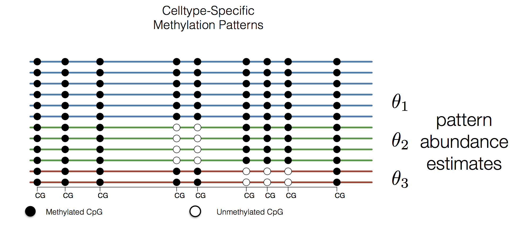
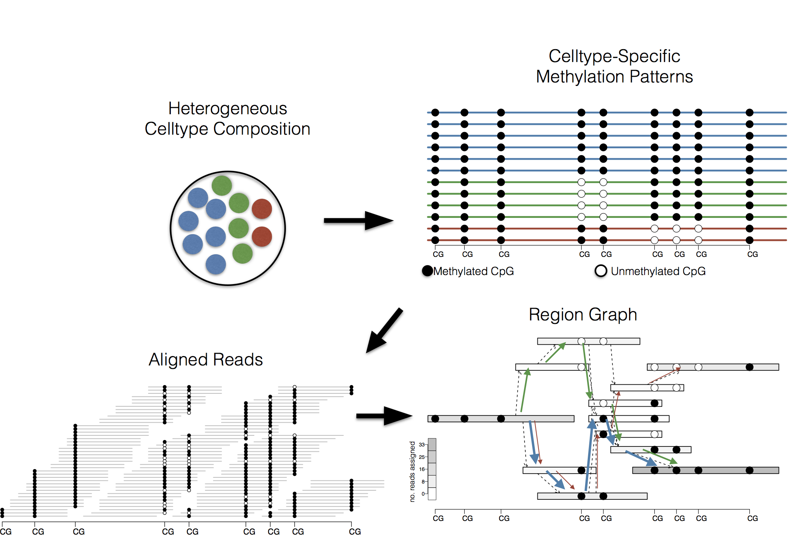
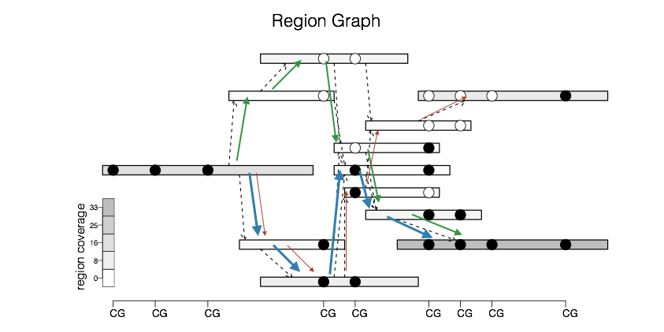

## This is a *heterogeneous* cell population

---

---

**Methylation pattern reconstruction problem**

- Given a set of mapped reads
- Determine _composition_ of cell-specific methylation patterns

---

**Methylation pattern reconstruction problem**

---

$$
\mathbb{E} y_v = \sum_{u:(v,u) |in E} \ell_{vu} \sum_{p:(v,u)\in p} \theta_p
$$

---

- Penalized method of moments:
  - number of parameters = number of paths through graph
  - sparsity inducing penalty to obtain solution with small number of patterns
  
$$
\min_{\theta_p} \sum_v |y_v - \sum_{u:(v,u)\in E} \ell_{vu} \sum_{p:(v,u)\in p} \theta_p | + \lambda \sum_p |\theta_p |
$$

