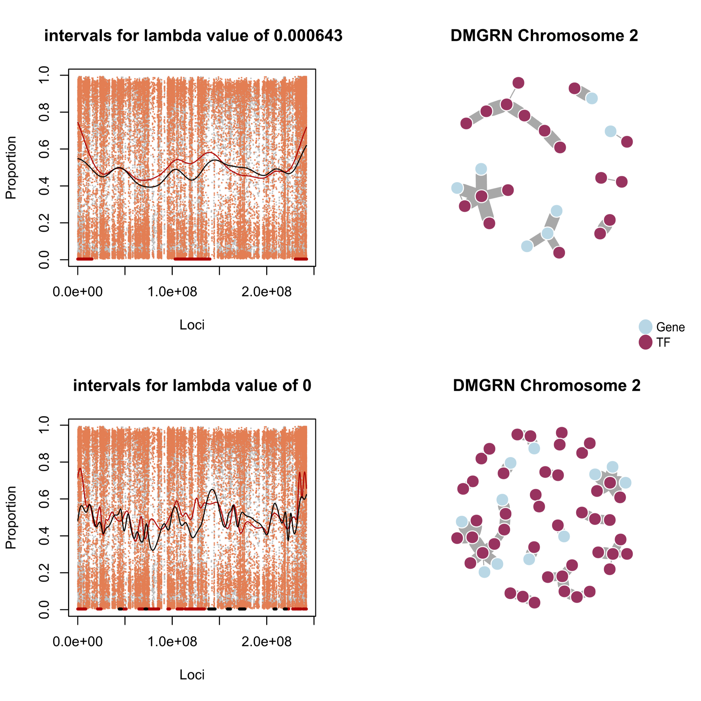
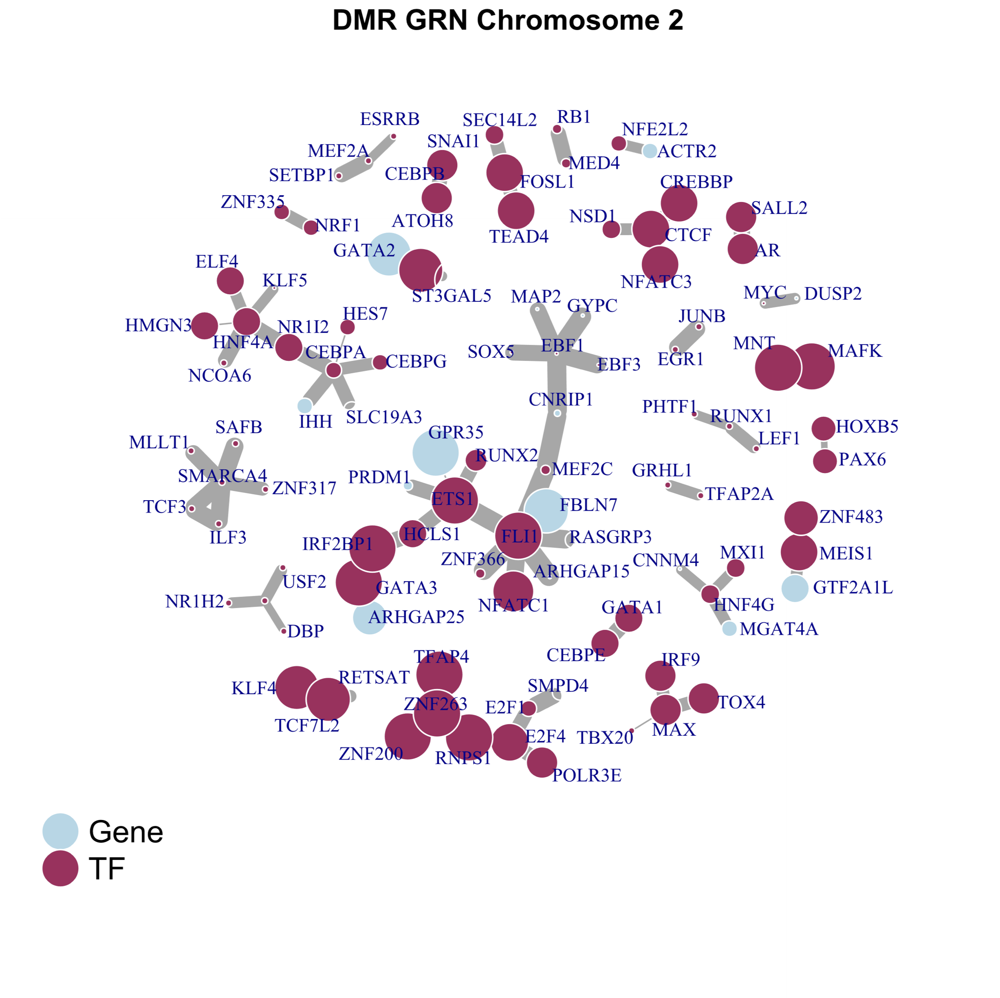

---
class: split-30, middle

## Multi-scale epigenome analysis

.column[
Different smoothing _bandwidth_ leads to different inferences (block width)

_Bandwidth_ reflects distinct _genomic scale_

_Genomic scale_ reflects (likely) distinct _gene regulatory mechanisms_
]

.column[
.center[.image-50[]]
]

---
class: split-30, middle

## Multiscale epigenome analysis

.column[
Different smoothing _bandwidth_ leads to different inferences (block width)

_Bandwidth_ reflects distinct _genomic scale_

_Genomic scale_ reflects (likely) _distinct gene regulatory mechanisms_
]

.column[
.center[.image-60[]]
]

---
class: split-30, middle

## Multiscale epigenome analysis

.column[
Different smoothing _bandwidth_ leads to different inferences (block width)

_Bandwidth_ reflects distinct _genomic scale_

_Genomic scale_ reflects (likely) _distinct gene regulatory mechanisms_
]

.column[
.center[.image-60[]]
]