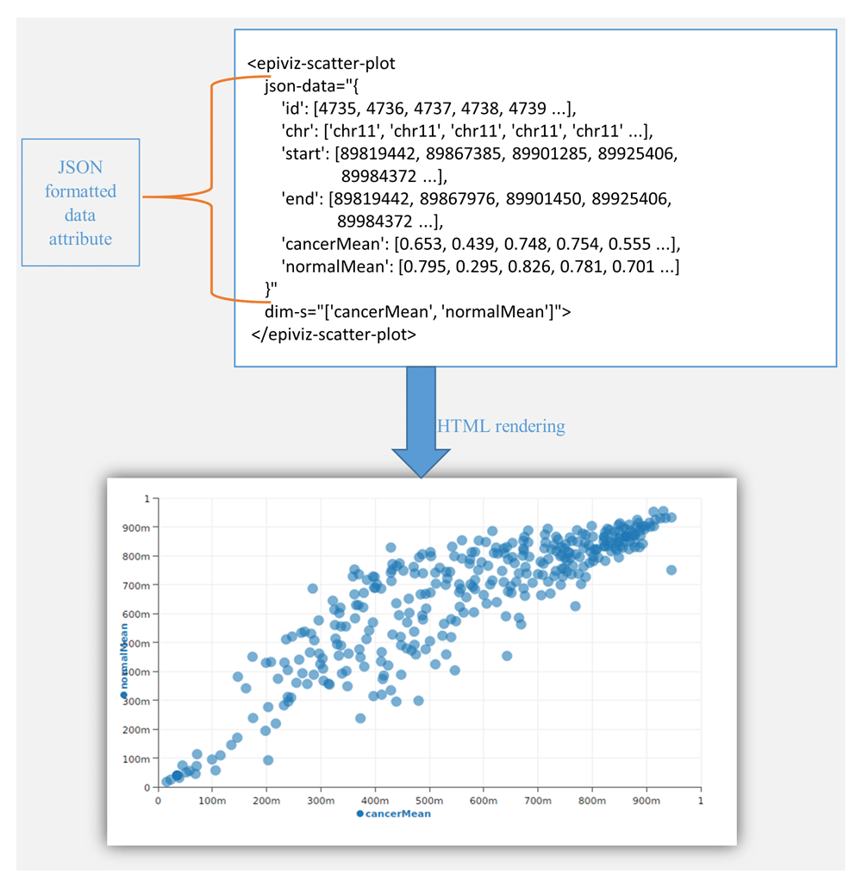
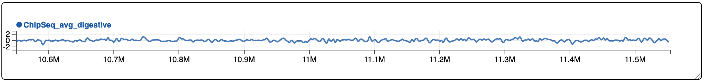

---

## Lessons Learned

### R/Bioconductor connection is a real success

- Fully scriptable UI  
  - interactive viz weaved with statistical analysis
  - _Reproducible_? (_Reconstructable_, really)
  
- Integrate interactive visualization as part of literate
  programming with Rmarkdown
  
- Bioconductor community as a resource: **think about role of interactive visualization in day to day data analysis**
  
---
class: split-60, middle

## Survey the community

.column[
- 65 respondents  
- Mostly expert level users and developers
- Data analyst rather than Biomedical Scientists

About half has used interactive visualization previously  
Predominantly through shiny: https://shiny.rstudio.com

]

.column[
.image-40[]
]


---

### Issues faced creating interactive visualizations

```{r echo=FALSE, message=FALSE}
library(tidyverse)
library(forcats)

theme_set(theme_minimal() + 
            theme(panel.grid.major = element_blank(),
                  panel.grid.minor = element_blank(),
                  panel.border = element_blank()))
```

```{r load_q26, echo=FALSE, cache=TRUE, message=FALSE}
q26_data <- read_csv("data/survey_q26.csv")
```

```{r plot_q26, echo=FALSE, fig.width=11}
q26_data %>% 
  count(value) %>%
  mutate(value=as_factor(value)) %>%
  mutate(value=reorder(value, n)) %>%
  ggplot() +
  aes(x=value, y=n) +
  geom_bar(stat="identity") +
  coord_flip() +
  labs(x="", y="number of responses") +
  theme(axis.text.y=element_text(size=20),
        axis.title.x=element_text(size=18),
        axis.text.x=element_text(size=14))
```

---
exclude: true

### Would like to see in genomic interactive visualization platform

```{r load_q23, echo=FALSE, message=FALSE, cache=TRUE}
q23_data <- read_csv("data/survey_q23.csv")
```

```{r q23_tab, echo=FALSE}
q23_data %>%
  count(Q23) %>%
  rename(value=Q23) %>%
  mutate(value=factor(value)) %>%
  mutate(value=reorder(value, n)) %>%
  arrange(desc(value)) %>%
  select(value, n) %>%
  knitr::kable('html', col.names=c("response", "num. respondents"),
               table.attr="class=survey_table") %>%
  kableExtra::kable_styling(bootstrap_options=c("condensed"))
```

---
exclude: true

## Takeaways

- Authoring, extensibility, infrastructure
- Collaboration within teams
- Interactive publishing and deposition

---
class: split-50

## Epiviz Web Components

.column[
Drop in epiviz visualization components

- Connected to either webserver or local R environment
- Can be embedded into HTML
- Reusable components

.source[https://f1000research.com/articles/7-1096/v1]
]

.column[
.center.image-50[]

]

---
class: split-50

## Epiviz File Server


.column[
- Query genomic data _in-situ_
]

.column[
```json
  {
    url: "https://egg2.wustl.edu/roadmap/data/byFileType/signal/consolidated/macs2signal/foldChange/E079-H3K27me3.fc.signal.bigwig",
    file_type: "bigwig",
    datatype: "bp",
    name: "E079-H3K27me3",
    annotation: {
        group: "digestive",
        tissue: "Esophagus",
        marker: "H3K27me3"
    }
  },
```
]

---
class: split-50

## Epiviz File Server


.column[
- Query genomic data _in-situ_
- Compute over _in-situ_ data
]

.column[
```python
import numpy
mMgr.add_computed_measurement(
  "ChipSeq average digestive tissue", 
  file_measurements, 
  computeFunc=numpy.mean)
```
]

---
class: split-50

## Epiviz File Server


.column[
- Query genomic data _in-situ_
- Compute over _in-situ_ data
- Drop-in visualization components (still cleaning this up)
]

.column[
```python
from IPython.display import HTML

HTML("<epiviz-line-track dim-s=['ChipSeq_avg_digestive'] json-data='" + ujson.dumps(resp.json()["data"]) + "'></epiviz-line-track>")
```
]

.center.image-100[]
.source[https://epiviz.github.io/post/2019-02-04-epiviz-fileserver/]
