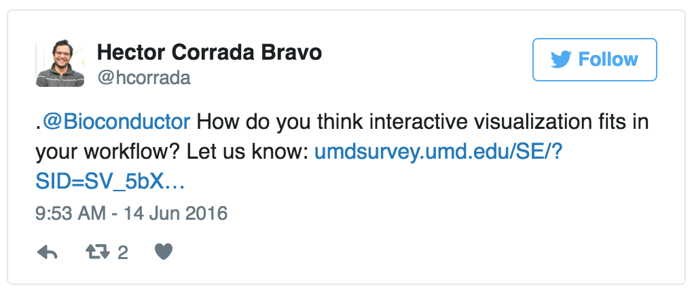

---

## Lessons Learned

### R/Bioconductor connection is a real success

- Fully scriptable UI  
  - interactive viz weaved with statistical analysis
  - _Reproducible_? (_Reconstructable_, really)
  
- Integrate interactive visualization as part of literate
  programming with Rmarkdown
  
- Bioconductor community as a resource: **think about role of interactive visualization in day to day data analysis**
  
---
class: split-60, middle

## Survey the community

### Online Bioconductor community survey

.column[
- 65 respondents  
- Mostly expert level users and developers
- Data analyst rather than Biomedical scientist
]

.column[
.image-40[]
]

About half has used interactive visualization previously  
Predominantly through shiny: https://shiny.rstudio.com

---

