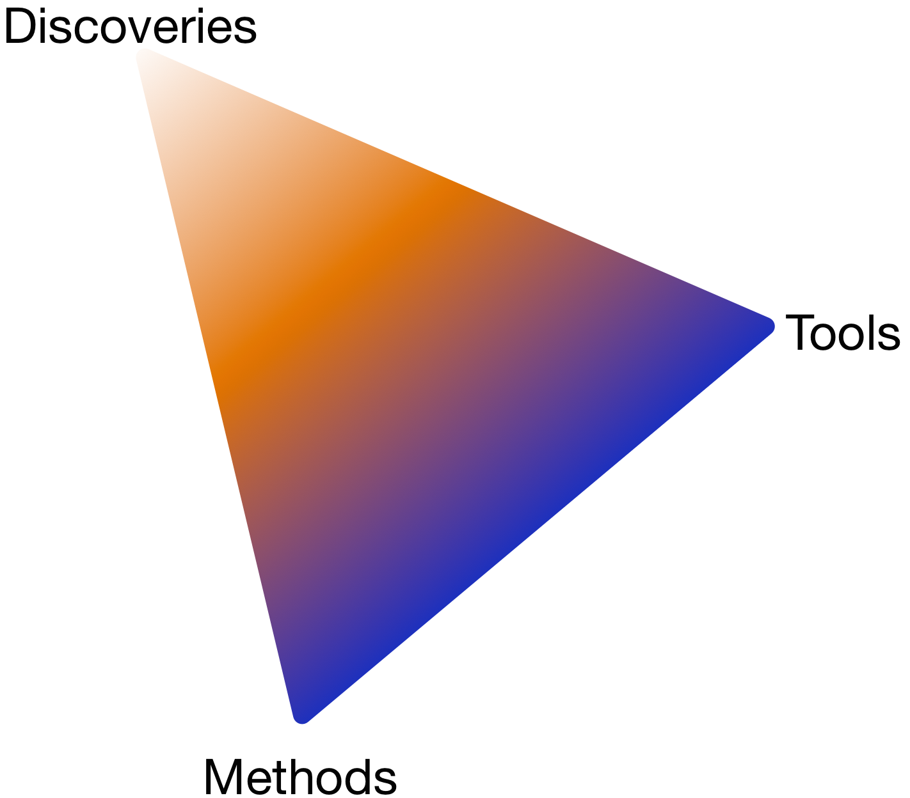

---

<div class="centered">

</div>

- Study the **molecular** basis of *variation* in development and disease
- Using **high-throughput** experimental methods


## The Genomic Revolution

- For over a decade we have laid the basic molecular blueprint by **sequencing** DNA

<div class="centered">

</div>

## The Genomic Revolution

**NHGRI strategic plan**

<div class="centered">

</div>

<footer class="source">[Nature, 2011]</footer>

## The Genomic Revolution

**NHGRI strategic plan**

"The major bottleneck in genome sequencing is no longer **data generation**—the computational challenges around **data analysis**, display and integration are now rate limiting. New approaches and methods are required to meet these challenges."

- Data analysis 
- Data integration
- Visualization
- Computational tools and infrastructure

<footer class="source">[Nature, 2011]</footer>

---

My group's work as a simplex



# Computational Epigenomics

```{r child='epigenomics.Rmd' }
```

```{r child='antiprofiles.Rmd' }
```

```{r child='methylflow.Rmd' }
```

## Moving forward

- move anti-profiles closer to the clinic
- explore _anomaly classification_ as a general learning setting
- methods to understand hierarchical organization of epigenomic domains
- better understand connection between intra-tumor heterogeneity and consistent hyper-variability in cancer

```{r child='epiviz.Rmd' }
```

## Moving forward

- collaborative computational and visual analysis (w/ N. Elmqvist @ HCIL)
- effective visual methods to explore hierarchical organization of genome
- deeper integration of statistically-informed visualization
- visualization-informed statistical analysis


---

- Discoveries: consistent hypo-methylation, hyper-variability
- Methods: anomaly classification as a setting to understand predictor stability
- Tools: computational and visual exploratory genomic data analysis


---

Tools

- `antiProfiles`
- `minfi`
- `bumphunter`
- `Rcplex`
- `Rcsdp`
- `BlindCall`
- `HTShape`
- `qsmooth`
- `epiviz`
- `epivizr`

## Metagenomics (mixed genomes)

<div class="centered">

</div>

<footer class="source">[Human Microbiome Project]</footer>


## Metagenomics (mixed genomes)

- Discoveries: pathogenic associations for childhood diarrhea in developing world. (Genome Biology, 2014)
- Methods: association discovery for metagenomic communities. (Nature Methods, 2013)
- Tools: `metagenomeSeq`, `metagenomicFeatures`, `metaviz`

---

**Coordinates**:

<div class="centered">

</div>

---

**Samples**:
<div class="centered">

</div>


---


<div class="centered">

</div>

Hierachically organized features

---

Hierarchically organized features

<div class="centered">

</div>

---

### NHGRI strategic plan

"Meeting the computational challenges for genomics requires scientists with expertise in biology as well as in informatics, computer science, mathematics, statistics and/or engineering." 

_A new generation of investigators who are proficient in two or more of these fields must be trained and supported._

---

###Acknowledgements
Colleagues at CBCB  
Past members of HCBravo group (now at Harvard, U. Chicago, Johns Hopkins, Genentech, Dow Jones Data Science)  
Current members of HCBravo group  
Collaborators at JHU/Harvard: Jeff Leek, Rafael A. Irizarry, Andy Feinberg, Winston Timp, Kasper Hansen, and Ben Langmead 

###More information
[http://hcbravo.org](http://hcbravo.org)  
[\@hcorrada](https://twitter.com/hcorrada)    


