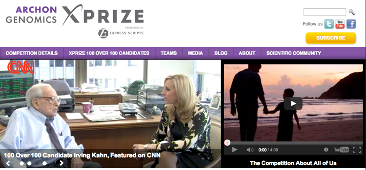

## What do we do

<div class="centered">

</div>

- Study the **molecular** basis of *variation* in development and disease
- Using **high-throughput** experimental methods


## The Genomic Revolution

- For over a decade we have laid the basic molecular blueprint by **sequencing** DNA

<div class="centered">

</div>


## The Genomic Revolution

<div class="centered">

</div>

build a **whole human genome** sequencing device and use it to sequence **100 human genomes** within **30 days or less**, with an accuracy of no more than one error in every 1,000,000 bases sequenced, with an accuracy rate of at least 98% of the genome, and at a recurring cost of **no more than $1,000 (US) per genome**.


## The Genomic Revolution

<div class="centered">

</div>

*“genome sequencing technology is plummeting in cost and increasing in speed independent of our competition”*

*“companies can do this for less than $5,000 per genome, in a few days or less — and 
are moving quickly towards the goals we set for the prize.”*


## The Genomic Revolution

**NHGRI strategic plan**

<div class="centered">

</div>

<footer class="source">[Nature, 2011]</footer>

## The Genomic Revolution

**NHGRI strategic plan**

"The major bottleneck in genome sequencing is no longer **data generation**—the computational challenges around **data analysis**, display and integration are now rate limiting. New approaches and methods are required to meet these challenges."

- Data analysis 
- Data integration
- Visualization
- Computational tools and infrastructure

<footer class="source">[Nature, 2011]</footer>


```{r child='epigenomics.Rmd' }
```


```{r child='antiprofiles.Rmd' }
```

```{r child='epiviz.Rmd' }
```


## What's next!

Beyond genomics and epigenomics: metagenomics

<div class="centered">

</div>

<footer class="source">[Human Microbiome Project]</footer>


## What's next!

Beyond genomics and epigenomics: metagenomics

**Coordinates**:

<div class="centered">

</div>


## What's next!

Beyond genomics and epigenomics: metagenomics

**Samples**:
<div class="centered">

</div>


## What's next!

Beyond genomics and epigenomics: metagenomics

<div class="centered">
<video width="320" height="240" controls>
  <source src="movies/metavizr1.mp4" type="video/mp4">
Your browser does not support the video tag.
</video>

</div>


## What's next!

Beyond genomics and epigenomics: metagenomics

<div class="centered">
<video width="320" height="240" controls>
  <source src="movies/metavizr2.mp4" type="video/mp4">
Your browser does not support the video tag.
</video>

</div>


###Acknowledgements
**Wikum Dinalankara**: (formerly) Ph.D. student @ U. Maryland (now postdoc @ Johns Hopkins)  
**Nick Thieme**: Ph.D. student @ U. Maryland  
Jeff Leek, Rafael A. Irizarry, Andy Feinberg  

###References
Corrada Bravo, et al. (2012) _BMC Bioinformatics_.  
Dinlanakara et al. (2015) _Cancer Informatics_.  
Dinalankara et al. _In preparation_  

###Contact
[http://hcbravo.org](http://hcbravo.org)  
[\@hcorrada](https://twitter.com/hcorrada)    


