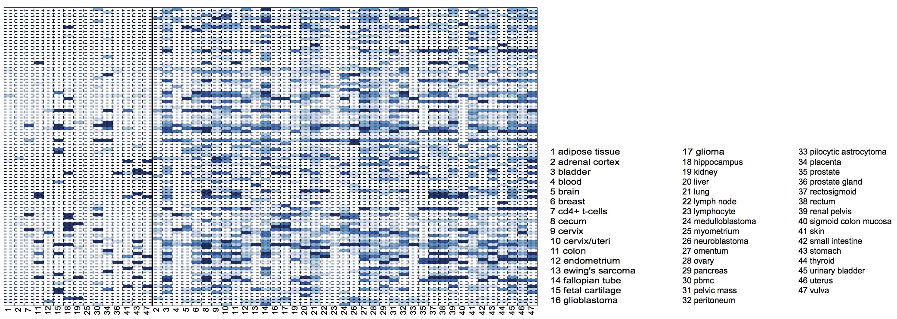
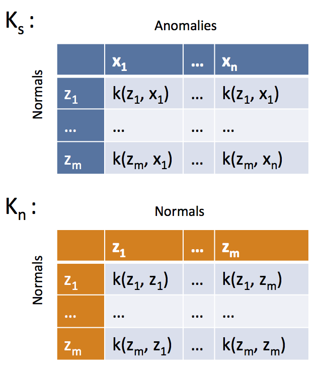
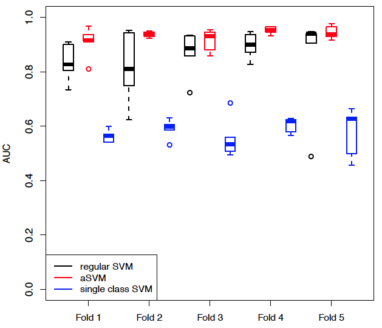

## What do we do

- Study the **molecular** basis of *variation* in development and disease
- Using **high-throughput** experimental methods

## The Genomic Revolution

- For over a decade we have laid the basic molecular blueprint by **sequencing** DNA

## The Genomic Revolution

build a **whole human genome** sequencing device and use it to sequence **100 human genomes** within **30 days or less**, with an accuracy of no more than one error in every 1,000,000 bases sequenced, with an accuracy rate of at least 98% of the genome, and at a recurring cost of **no more than $1,000 (US) per genome**.

## The Genomic Revolution

*“genome sequencing technology is plummeting in cost and increasing in speed independent of our competition”*

*“companies can do this for less than $5,000 per genome, in a few days or less — and 
are moving quickly towards the goals we set for the prize.”*

## The Genomic Revolution

**NHGRI strategic plan**

<footer class="source">[Nature, 2011]</footer>

## The Genomic Revolution

**NHGRI strategic plan**

"The major bottleneck in genome sequencing is no longer **data generation**—the computational challenges around **data analysis**, display and integration are now rate limiting. New approaches and methods are required to meet these challenges."

- Data analysis 
- Data integration
- **Visualization**
- Computational tools and infrastructure

<footer class="source">[Nature, 2011]</footer>

## What is Epigenomics?

What makes them different?

Much human variation is due to difference in ~ 6 million DNA base pairs (0.1 % of genome) 

## What is Epigenomics?

What makes them different?

Same genome is **expressed** differently during different **stages** and in different **tissues**.

## What is Epigenomics?

DNA is packed, making parts inaccessible, and this packing is **dynamic**!

## What is Epigenomics?

DNA methylation is a chemical modification of DNA, regulates *gene expression*.

<footer class="source">[Robertson and Wolffe, Nat Rev Genet, 2000]</footer>

## Our motivation

Measuring DNA methylation and understanding role in expression regulation in solid tumors

Large blocks of *hypo-methylation* (sometimes Mbps long) in colon cancer

- **Hansen, et al., *Nat. Genetics*, 2011**
- Corrada Bravo, et al., *BMC Bioinformatics*, 2012
- Timp, et al., *Genome Medicine*, 2014
- Dinalankara and Corrada Bravo, *Cancer Informatics*, in press.

## Our motivation

Measuring DNA methylation and understanding role in expression regulation in solid tumors

Genes with *hyper-variable* expression in colon cancer are enriched within these blocks.

- **Hansen, et al., *Nat. Genetics*, 2011**
- Corrada Bravo, et al., *BMC Bioinformatics*, 2012
- Timp, et al., *Genome Medicine*, 2014
- Dinalankara and Corrada Bravo, *Cancer Informatics*, in press.

## Our motivation

Measuring DNA methylation and understanding role in expression regulation in solid tumors

Genes with *consistent hyper-variable expression* across tumors are tissue-specific.

- Hansen, et al., *Nat. Genetics*, 2011
- **Corrada Bravo, et al., *BMC Bioinformatics*, 2012**
- Timp, et al., *Genome Medicine*, 2014
- Dinalankara and Corrada Bravo, *Cancer Informatics*, in press.

## Gene Expression Anti-profiles 

 

Motivated by observations that gene expression hyper-variability is enriched in specific regions of epigenetic alteration in colon cancer...

## Gene Expression Anti-profiles 

...and that _consistent hypervariability_ across tumor types is enriched in genes involved in tissue specificity

## Gene Expression Anti-profiles 

_anti-profile score_: measures sample-specific deviation from normal expression in consistently hyper-variable genes

## Gene Expression Anti-profiles 

Good cross-experiment properties  
Stability in _normal_ expression across experiments

## Gene Expression Anti-profiles

Prediction in leave-one-tissue out experiment  

## Gene Expression Anti-profiles 

Anti-profile score distinguishes between stages in tumor progression

## Gene Expression Anti-profiles

DNA methylation anti-profiles score distinguishes between stages in tumor progression

## Gene Expression Anti-profiles 

Stratification based on anti-profile score

## Gene Expression Anti-profiles { .hcb_image }

Stratification of breast samples based on anti-profile score

## Summary

>- Simple counting scheme produces robust stable and accurate (anti)-profiles  
>- Nice prediction properties _across experiments_ and _across tissue types_  
>- Captures increasing hyper-variability associated with progression and prognosis

---

# Stability Analysis via Large-Margin Function Approximation

# Stability Analysis via Support Vector Machines

## One-class Support Vector Machines 

Support Vector Machines for Anomaly Detection: determine if observations belong to a given group or are _anomalies_.

## Anomaly Classification

>- Distinguish observations from two _anomalous_ groups (e.g., adenoma vs. tumor)

>- How can we incorporate the fact that we are classifying anomalies?

>- Why (and when) is it worth doing that?

## Anomaly Support Vector Machine 

Learning functions in space spanned by (representers) of normal samples

$$
f(x) = \sum_i c_i k(x, z_i) + d
$$

where $z_i$ are _normal_ observations.

## Anomaly Support Vector Machine 

Estimated as solution to optimization problem (like regular SVM) by solving

$$
\min_{c,d} \sum_j (1-y_jf_j)_+ + c'\tilde{K}c
$$

with $f_j = \sum_i c_i k(x_j,z_i) + d$, and  
$\tilde{K}=K_s K_n^{-1} K_s$

## Anomaly Support Vector Machine

>- Based on leave-one-out error bounds (via stability arguments)
>- $K \succeq \tilde{K}$, implies LOO error bound of Anomaly SVM is lower than LOO error bound of standard pairwise between anomalies SVM
>- Proof uses arguments based on the SVM path algorithm, and required conditions

## Stability and accuracy of Anomaly SVM 

Prediction of high vs. low relapse risk in lung cancer 

## Stability and accuracy of Anomaly SVM 

Prediction of _suspect_ vs. _pathological_ fetal CTG data (*not genomics*)

## Summary

>- Profiles learned based on hyper-variability show consistent behavior across tissues and across experiments in tumor prognosis and progression

>- We can extend the general anti-profile idea to a function approximation setting

>- Use sensitivity-based cross-validation error bounds to characterize the effect of incorporating normal observations when classifying between anomalies

>- Indirect _similarity_ through normal samples improves stability while improving prediction performance

---

###Acknowledgements
**Wikum Dinalankara**: (formerly) Ph.D. student @ U. Maryland (now postdoc @ Johns Hopkins)  
**Nick Thieme**: Ph.D. student @ U. Maryland  
Jeff Leek, Rafael A. Irizarry, Andy Feinberg  

###References
Corrada Bravo, et al. (2012) _BMC Bioinformatics_.  
Dinlanakara et al. (2015) _Cancer Informatics_.  
Dinalankara et al. _In preparation_  

###Contact
[http://hcbravo.org](http://hcbravo.org)  
[\@hcorrada](https://twitter.com/hcorrada)    

